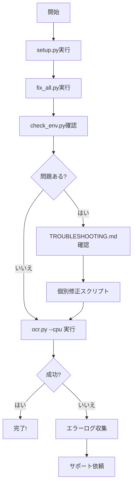

# MacOS MPS ファイル概要

このディレクトリには、DeepSeek-OCRをMacOS上で動作させるためのすべてのファイルが含まれています。

## 📚 ドキュメント

### メインガイド

| ファイル | 説明 | 対象者 |
|---------|------|--------|
| **SETUP_COMPLETE.md** (7.5K) | 完全なセットアップガイド - すべての手順を含む | 初めて使う方 ⭐ |
| **QUICK_START_JP.md** (4.7K) | クイックスタートガイド（日本語） | 経験者向け |
| **README.md** (8.2K) | プロジェクト概要と基本的な使い方 | すべてのユーザー |
| **README_MPS.md** (6.3K) | MPS実装の技術詳細 | 開発者向け |

### トラブルシューティング

| ファイル | 説明 |
|---------|------|
| **TROUBLESHOOTING.md** (12K) | 詳細なトラブルシューティングガイド - すべてのエラーと解決方法 ⭐ |
| **QUICK_FIX.md** (2.8K) | Flash Attentionエラーのクイックフィックス |

## 🛠️ セットアップスクリプト

| ファイル | 目的 | 推奨度 |
|---------|------|-------|
| **setup.py** (6.8K) | 初期セットアップ - 依存関係とモデルのダウンロード | ⭐⭐⭐⭐⭐ |
| setup_and_fix.py (8.3K) | セットアップと修正を統合（旧版） | ⭐ |
| setup_and_fix_v2.py (11K) | セットアップと修正を統合（改良版） | ⭐⭐ |

**推奨:** まず`setup.py`を実行してください。

## 🔧 修正スクリプト

### 総合修正

| ファイル | 説明 | 推奨度 |
|---------|------|-------|
| **fix_all.py** (8.6K) | すべての互換性問題を一度に修正 | ⭐⭐⭐⭐⭐ |

### 個別修正

| ファイル | 対応するエラー | サイズ |
|---------|---------------|-------|
| fix_correct.py (4.9K) | LlamaFlashAttention2 / LlamaSdpaAttention | ⭐⭐⭐⭐ |
| fix_cuda_aggressive.py (3.8K) | CUDA not available エラー | ⭐⭐⭐ |
| fix_mps_device.py (6.1K) | MPS device placement エラー（実験的） | ⭐⭐ |
| fix_cache.py (3.8K) | DynamicCache.seen_tokens エラー | ⭐⭐ |
| fix_cuda.py (3.9K) | CUDA参照検出（旧版） | ⭐ |
| fix_model.py (6.3K) | 一般的なモデル修正（旧版） | ⭐ |
| fix_now.py (3.1K) | 緊急修正（旧版） | ⭐ |

**推奨順序:**
1. `fix_all.py` - まずこれを試す
2. 問題が残る場合は個別スクリプトを使用

## 🔍 診断ツール

| ファイル | 目的 |
|---------|------|
| **check_env.py** (1.9K) | 環境とtransformersバージョンの確認 |
| **debug_cache.py** (1.8K) | キャッシュ構造の確認 |
| check_transformers.py (1.1K) | transformers詳細チェック |

## 🚀 実行スクリプト

### メインツール

| ファイル | 説明 | 推奨度 |
|---------|------|-------|
| **ocr.py** (7.9K) | シンプルなCLIツール - 推奨の実行方法 | ⭐⭐⭐⭐⭐ |
| demo.py (9.2K) | インタラクティブデモ | ⭐⭐⭐ |
| run_deepseek_ocr_mps.py (6.1K) | 初期実装版 | ⭐⭐ |
| example_usage.py (7.6K) | Pythonコード例 | ⭐⭐⭐ |

**推奨:** `ocr.py`を使用してください。最もシンプルで使いやすいです。

### 使用例

```bash
# 基本的な使い方
python ocr.py image.png

# CPUモード（推奨）
python ocr.py --cpu image.png

# バッチ処理
python ocr.py --batch image1.png image2.png

# マークダウン出力
python ocr.py --markdown document.png
```

## 🧩 コアモジュール

| ファイル | 説明 |
|---------|------|
| sam_vary_mps.py (13K) | MPS対応SAMビジョンエンコーダー |
| clip_mps.py (8.7K) | MPS対応CLIPビジョンエンコーダー |
| projector.py (974B) | Vision-Languageプロジェクター |

これらは`ocr.py`や`demo.py`から自動的にインポートされるため、直接実行する必要はありません。

## 🎯 クイックリファレンス

### 初めて使う場合

1. **セットアップ:**
   ```bash
   python setup.py
   python fix_all.py
   ```

2. **実行:**
   ```bash
   python ocr.py --cpu image.png
   ```

### 問題が発生した場合

1. **診断:**
   ```bash
   python check_env.py
   python debug_cache.py
   ```

2. **修正:**
   ```bash
   python fix_all.py
   ```

3. **ドキュメント確認:**
   ```bash
   cat TROUBLESHOOTING.md
   ```

### 最適なワークフロー



## 📊 ファイルサイズ一覧

### ドキュメント (合計: 41.5K)
- TROUBLESHOOTING.md: 12K
- README.md: 8.2K
- SETUP_COMPLETE.md: 7.5K
- README_MPS.md: 6.3K
- QUICK_START_JP.md: 4.7K
- QUICK_FIX.md: 2.8K

### Pythonスクリプト (合計: 122.9K)
- sam_vary_mps.py: 13K
- setup_and_fix_v2.py: 11K
- demo.py: 9.2K
- clip_mps.py: 8.7K
- fix_all.py: 8.6K
- setup_and_fix.py: 8.3K
- ocr.py: 7.9K
- example_usage.py: 7.6K
- setup.py: 6.8K
- fix_model.py: 6.3K
- run_deepseek_ocr_mps.py: 6.1K
- fix_mps_device.py: 6.1K
- fix_correct.py: 4.9K
- fix_cuda.py: 3.9K
- fix_cuda_aggressive.py: 3.8K
- fix_cache.py: 3.8K
- fix_now.py: 3.1K
- check_env.py: 1.9K
- debug_cache.py: 1.8K
- check_transformers.py: 1.1K
- projector.py: 974B

**合計: 約164K** のMPS対応コードとドキュメント

## 🌟 重要なファイル（星5つ）

初めて使う場合、以下のファイルだけ知っていれば十分です：

1. **SETUP_COMPLETE.md** - セットアップガイド
2. **setup.py** - セットアップスクリプト
3. **fix_all.py** - 修正スクリプト
4. **ocr.py** - 実行ツール
5. **TROUBLESHOOTING.md** - 問題解決ガイド

この5つのファイルで、ほとんどのユースケースをカバーできます。

## 🔄 ファイルの歴史

### 初期実装（v1）
- run_deepseek_ocr_mps.py
- sam_vary_mps.py
- clip_mps.py
- projector.py

### セットアップ改善（v2）
- setup.py
- fix_model.py
- fix_now.py

### エラー対応（v3）
- fix_correct.py
- fix_cuda.py
- fix_cuda_aggressive.py
- fix_cache.py
- fix_mps_device.py

### 統合（v4 - 現在）
- **fix_all.py** ← すべての修正を統合
- **SETUP_COMPLETE.md** ← すべての知識を統合
- **ocr.py** ← 最もシンプルなUI

## 🎓 学習パス

### 初心者向け
1. SETUP_COMPLETE.md を読む
2. setup.py を実行
3. fix_all.py を実行
4. ocr.py を使う

### 中級者向け
1. README_MPS.md を読む
2. example_usage.py を参照
3. demo.py を試す
4. 個別修正スクリプトを理解

### 上級者/開発者向け
1. sam_vary_mps.py のソースを読む
2. clip_mps.py の実装を理解
3. fix_all.py のロジックを学ぶ
4. 独自の修正スクリプトを作成

## 💡 ヒント

- **迷ったら:** SETUP_COMPLETE.mdから始める
- **エラーが出たら:** TROUBLESHOOTING.mdを見る
- **速く解決したい:** fix_all.pyを実行
- **学びたい:** README_MPS.mdを読む

---

**最終更新:** 2025-10-21
**ファイル数:** 26個
**合計サイズ:** 約164KB
